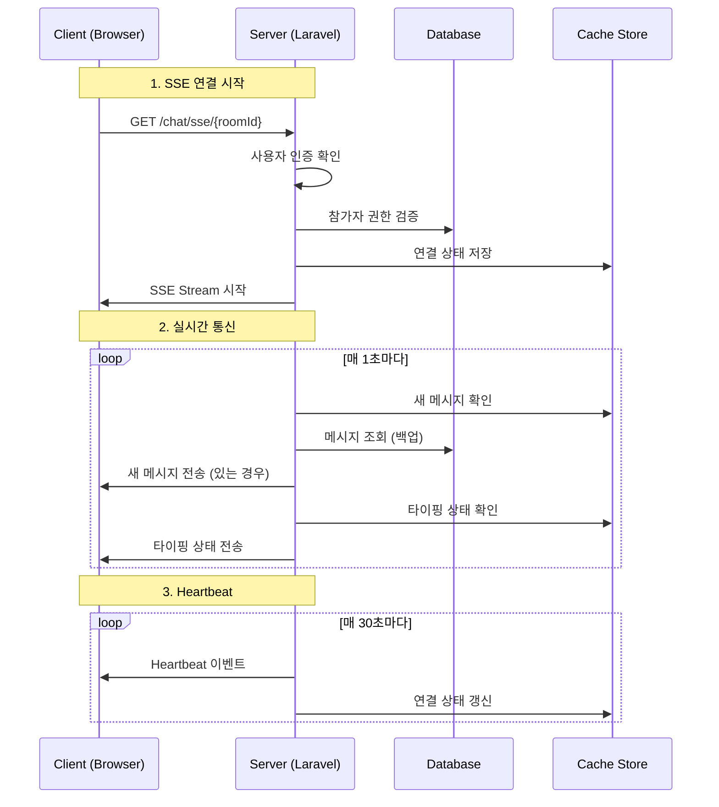
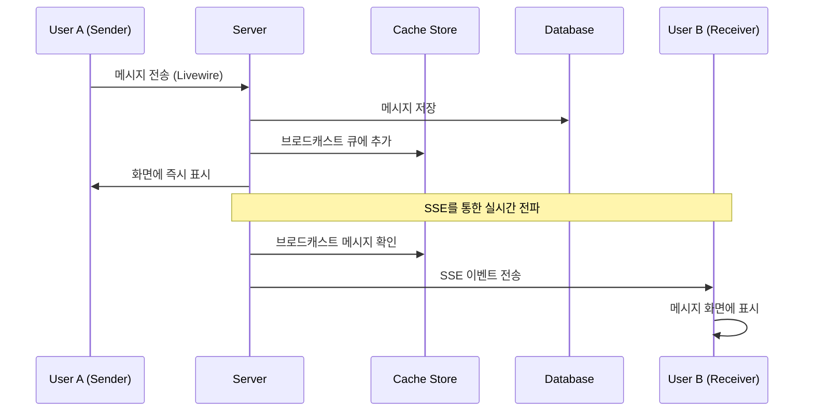

# Jiny Chat 서버 통신 방식

## 개요

Jiny Chat은 **Server-Sent Events (SSE)** 기반의 실시간 채팅 시스템으로, 기존 폴링 방식의 단점을 해결하고 진정한 실시간 통신을 제공합니다.

## 1. 통신 아키텍처

### 1.1 전체 구조
```
┌─────────────────┐    SSE Stream    ┌─────────────────┐
│   Frontend      │ ←───────────────→ │   Backend       │
│   (Livewire)    │                  │   (Laravel)     │
└─────────────────┘                  └─────────────────┘
         ↓                                     ↓
┌─────────────────┐                  ┌─────────────────┐
│   JavaScript    │                  │   Cache Store   │
│   EventSource   │                  │   (Redis/File)  │
└─────────────────┘                  └─────────────────┘
```

### 1.2 구성 요소

1. **Frontend**: Livewire 컴포넌트 + JavaScript EventSource
2. **Backend**: Laravel SSE 컨트롤러 + 캐시 시스템
3. **데이터 저장**: MySQL/SQLite + Redis/File Cache

## 2. Server-Sent Events (SSE) 방식

### 2.1 SSE란?
- **단방향 통신**: 서버 → 클라이언트로만 데이터 전송
- **HTTP 기반**: 기존 HTTP 인프라 활용 가능
- **자동 재연결**: 브라우저에서 자동으로 연결 복구
- **이벤트 스트림**: 실시간 이벤트 기반 데이터 전송

### 2.2 SSE 연결 플로우



## 3. 메시지 전송 및 브로드캐스팅

### 3.1 메시지 전송 플로우



### 3.2 브로드캐스팅 시스템

#### 캐시 기반 브로드캐스팅
```php
// 메시지 브로드캐스트 저장
$broadcastKey = "chat_broadcast:{$roomId}";
$broadcasts[] = [
    'type' => 'new_message',
    'message' => $formattedMessage,
    'room_id' => $roomId,
    'timestamp' => now()->toISOString(),
    'sender_uuid' => $this->user->uuid
];
Cache::put($broadcastKey, $broadcasts, 60); // 1분 TTL
```

#### SSE 스트림에서 브로드캐스트 확인
```php
// SSE 컨트롤러에서 실시간 확인
private function checkBroadcastMessages($roomId, $user)
{
    $broadcasts = Cache::get("chat_broadcast:{$roomId}", []);
    foreach ($broadcasts as $broadcast) {
        if ($broadcast['sender_uuid'] !== $user->uuid) {
            echo "event: new_message\n";
            echo "data: " . json_encode($broadcast) . "\n\n";
            flush();
        }
    }
}
```

## 4. 핵심 컴포넌트

### 4.1 ChatSseController
**위치**: `/src/Http/Controllers/ChatSseController.php`

**주요 메서드**:
- `stream()`: SSE 스트림 시작
- `updateTyping()`: 타이핑 상태 업데이트
- `status()`: 연결 상태 확인

**기능**:
- 실시간 메시지 스트림 제공
- 자동 재연결 및 Heartbeat
- 타이핑 상태 관리
- 연결 상태 추적

### 4.2 ChatMessages Livewire 컴포넌트
**위치**: `/src/Http/Livewire/ChatMessages.php`

**주요 변경사항**:
- `wire:poll` 폴링 제거
- `handleSseMessage()`: SSE 메시지 수신 처리
- `broadcastNewMessage()`: 메시지 브로드캐스트
- `updateTypingUsers()`: 타이핑 상태 업데이트

### 4.3 Frontend JavaScript
**위치**: `/resources/views/livewire/chat-messages.blade.php`

**EventSource 구현**:
```javascript
// SSE 연결 초기화
function initSSE() {
    const sseUrl = `/chat/sse/${roomId}?last_message_id=${lastMessageId}`;
    eventSource = new EventSource(sseUrl);

    // 새 메시지 수신
    eventSource.addEventListener('new_message', function(event) {
        const data = JSON.parse(event.data);
        @this.call('handleSseMessage', data.message);
    });

    // 자동 재연결
    eventSource.onerror = function(event) {
        setTimeout(() => initSSE(), delay);
    };
}
```

## 5. 실시간 기능들

### 5.1 메시지 전송
- **즉시 표시**: 발신자 화면에 즉시 표시
- **실시간 전파**: SSE를 통해 다른 사용자에게 즉시 전송
- **메시지 포맷팅**: 시간, 발신자 정보, 답장 등 포함

### 5.2 타이핑 상태
```php
// 타이핑 상태 저장
$typingUsers = Cache::get("chat_typing:{$roomId}", []);
$typingUsers[$user->uuid] = [
    'user_uuid' => $user->uuid,
    'user_name' => $user->name,
    'started_at' => now()->toISOString()
];
Cache::put("chat_typing:{$roomId}", $typingUsers, 10); // 10초 TTL
```

### 5.3 연결 상태 관리
- **연결 추적**: 각 사용자의 SSE 연결 상태 모니터링
- **자동 정리**: 연결 종료 시 캐시에서 자동 제거
- **활성 사용자**: 실시간 온라인 사용자 수 확인

## 6. 성능 최적화

### 6.1 캐시 전략
- **브로드캐스트 메시지**: 1분 TTL로 최근 메시지만 유지
- **타이핑 상태**: 10초 TTL로 짧은 생명주기
- **연결 상태**: 65초 TTL로 Heartbeat보다 길게 설정

### 6.2 메모리 관리
- **메시지 제한**: 한 번에 최대 50개 메시지 처리
- **브로드캐스트 제한**: 최근 10개 브로드캐스트만 유지
- **자동 정리**: TTL 기반 자동 캐시 정리

### 6.3 네트워크 최적화
- **이벤트 기반**: 변화가 있을 때만 데이터 전송
- **압축**: JSON 형태로 최소화된 데이터 전송
- **재연결 로직**: 지수 백오프 방식으로 재연결 시도

## 7. 장점 및 특징

### 7.1 기존 폴링 방식 대비 장점
| 구분 | 폴링 방식 | SSE 방식 |
|------|-----------|----------|
| **실시간성** | 3초 지연 | 즉시 전송 |
| **서버 부하** | 정기적 요청 | 이벤트 기반 |
| **네트워크** | 불필요한 요청 | 필요시에만 전송 |
| **배터리** | 높은 소모 | 낮은 소모 |
| **확장성** | 제한적 | 우수함 |

### 7.2 SSE 방식의 특징
- **단순성**: WebSocket보다 간단한 구현
- **호환성**: 기존 HTTP 인프라 활용
- **안정성**: 브라우저 자동 재연결 지원
- **효율성**: 단방향 통신으로 오버헤드 최소화

## 8. 확장 가능성

### 8.1 향후 개선 방향
1. **Redis Pub/Sub**: 다중 서버 환경 지원
2. **WebSocket 업그레이드**: 양방향 통신 필요 시
3. **메시지 큐**: 대용량 처리를 위한 큐 시스템
4. **CDN 연동**: 파일 전송 최적화

### 8.2 모니터링 및 관리
- **연결 통계**: 실시간 연결 수 모니터링
- **성능 메트릭**: 메시지 전송 속도 측정
- **오류 추적**: SSE 연결 오류 로깅
- **사용자 활동**: 채팅 활동 분석

이러한 SSE 기반 아키텍처를 통해 Jiny Chat은 효율적이고 확장 가능한 실시간 채팅 서비스를 제공합니다.